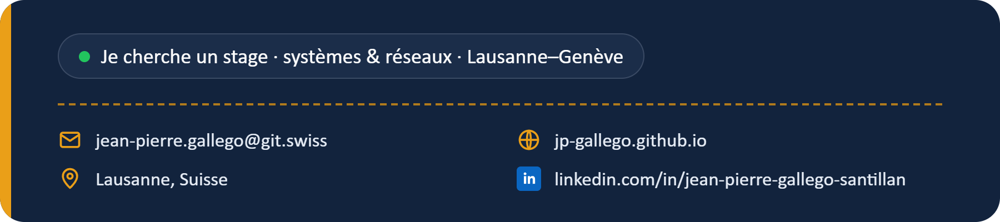

<a href="https://jp-gallego.github.io"></a>

<p align="center">
  <a href="https://jp-gallego.github.io/cv-jean-pierre-gallego.pdf"></a>
  <a href="https://www.linkedin.com/in/jean-pierre-gallego-santillan-6b4701433"></a>
  <br>
  <a href="https://jp-gallego.github.io/jean-pierre-gallego.vcf"></a>
  <a href="mailto:jean-pierre.gallego@git.swiss"></a>
</p>

## Qui je suis

Je m'appelle Jean-Pierre, j'ai 25 ans et je suis en 1re année d'apprentissage **CFC informaticien** au Geneva Institute of Technology, à Genève.

Je ne pars pas de zéro. Pendant 5 ans comme monteur électricien, j'ai tiré du câble CAT 6/7 et de la fibre optique, raccordé des prises et des racks et testé les liaisons réseau sur les chantiers. Au service militaire, j'étais soldat sanitaire avec une spécialisation transmission : j'utilisais les systèmes de communication et je dépannais le matériel numérique.

Depuis la rentrée, j'ai monté un réseau Cisco sous GNS3 avec du DHCP, installé ESXi et vCenter sur un vrai serveur rack, déployé des postes à partir d'une image système (Sysprep, Clonezilla) et sécurisé un poste partagé par plusieurs utilisateurs. Pour chaque projet, j'écris un rapport complet : les étapes, les captures, mes erreurs et comment je les ai corrigées.

**Ce que j'apporte à une équipe**

- **Le terrain** : je sais à quoi ressemble une baie, un rack ou une liaison qui ne passe pas.
- **Des bases en systèmes et réseau** : Windows, Ubuntu, virtualisation, routage et DHCP, que je pratique chaque semaine.
- **De la méthode** : je documente tout, étape par étape, pour que quelqu'un d'autre puisse refaire.
- **Le sens du service** : 5 ans de contact avec les clients et un respect strict des règles de sécurité.

**Je cherche un stage en systèmes, réseaux et infrastructure, entre Lausanne et Genève.**

```
2017 ─ 2020   CFC d'électricien
2021 ─ 2026   Monteur électricien (câblage réseau, fibre, racks)
2025          Service militaire : soldat sanitaire, spécialisation transmission
2026 ─ ...    Apprentissage CFC informaticien au GIT
```

## Mes projets

Tous mes rapports sont rangés dans mon portfolio : **[Projet-cfc-informaticien](https://github.com/jp-gallego/Projet-cfc-informaticien)**. Chaque rapport contient les étapes, les captures d'écran et les problèmes que j'ai eus.

**Les 5 principaux**

- **[Réseau sous GNS3 : deux routeurs Cisco et DHCP](https://github.com/jp-gallego/Projet-cfc-informaticien/tree/main/Reseau-GNS3-routage-DHCP)** : deux LAN reliés par deux routeurs, le DHCP sur chaque routeur et les pannes que j'ai trouvées.
- **[ESXi et vCenter sur un vrai serveur](https://github.com/jp-gallego/Projet-cfc-informaticien/tree/main/ESXi-vCenter)** : ESXi 8 sur un HP ProLiant, une VM Windows Server 2025, puis vCenter et un cluster.
- **[Déployer des postes avec une image système](https://github.com/jp-gallego/Projet-cfc-informaticien/tree/main/Projet-5-Deploiement-image-systeme)** : un poste de référence préparé avec Sysprep, capturé puis redéployé avec Clonezilla.
- **[Un poste partagé par plusieurs élèves](https://github.com/jp-gallego/Projet-cfc-informaticien/tree/main/Projet-2-Poste-multi-utilisateurs)** : un compte par élève, droits NTFS, verrouillage de session et règles de mots de passe.
- **[Installer Windows et Ubuntu avec une clé USB](https://github.com/jp-gallego/Projet-cfc-informaticien/tree/main/Installation-Windows-Ubuntu-cle-USB)** : clé bootable avec Rufus, démarrage par le BIOS, puis les deux installations sur un vrai PC.

**Les autres**

- [Windows 11 sur VMware Workstation](https://github.com/jp-gallego/Projet-cfc-informaticien/tree/main/Installation-Windows-11-VMware)
- [Mise en service d'un poste](https://github.com/jp-gallego/Projet-cfc-informaticien/tree/main/Projet-1-Mise-en-service-poste)
- [Migration et réinstallation d'un poste](https://github.com/jp-gallego/Projet-cfc-informaticien/tree/main/Projet-3-Migration-poste)
- [Dépannage d'une carte réseau](https://github.com/jp-gallego/Projet-cfc-informaticien/tree/main/Projet-4-Depannage-poste)

## Ce que j'utilise

**Systèmes :** `Windows 10 / 11` `Ubuntu` `PowerShell` `comptes et droits NTFS` `Sysprep` `Clonezilla`  
**Virtualisation :** `VMware Workstation` `ESXi 8` `vCenter`  
**Réseau :** `GNS3` `Cisco IOS` `DHCP` `routage statique` `adressage IP`  
**Sur le terrain :** `câblage CAT 6/7` `fibre optique` `prises et racks` `tests de liaison`

Langues : français et espagnol (langues maternelles), anglais (A2).

---

<p align="center">
  Lausanne · <a href="mailto:jean-pierre.gallego@git.swiss">jean-pierre.gallego@git.swiss</a> · <a href="https://jp-gallego.github.io">jp-gallego.github.io</a>
</p>
