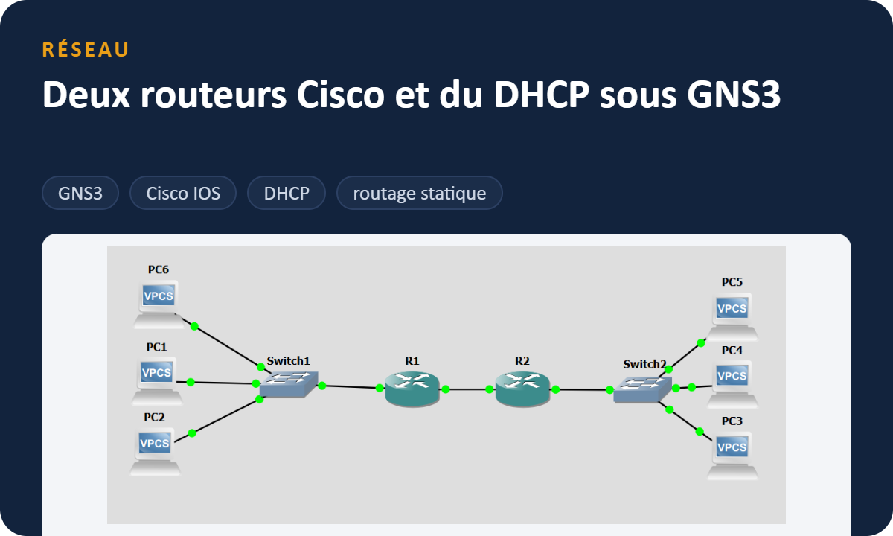
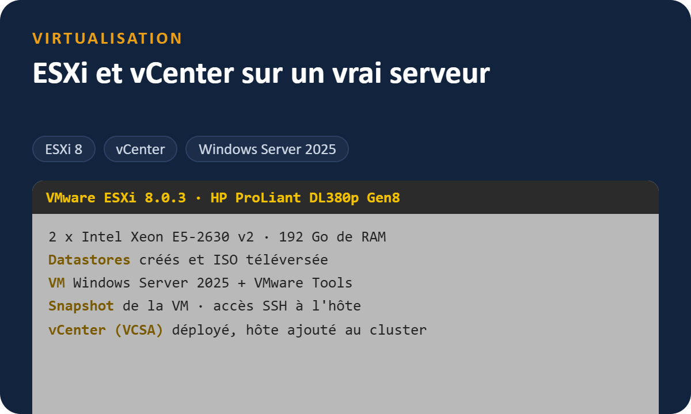
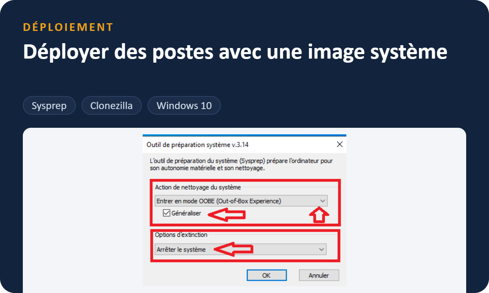
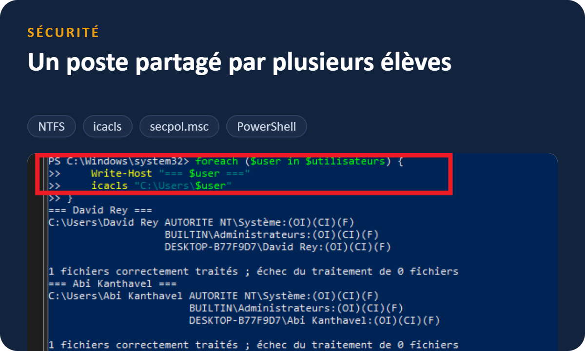
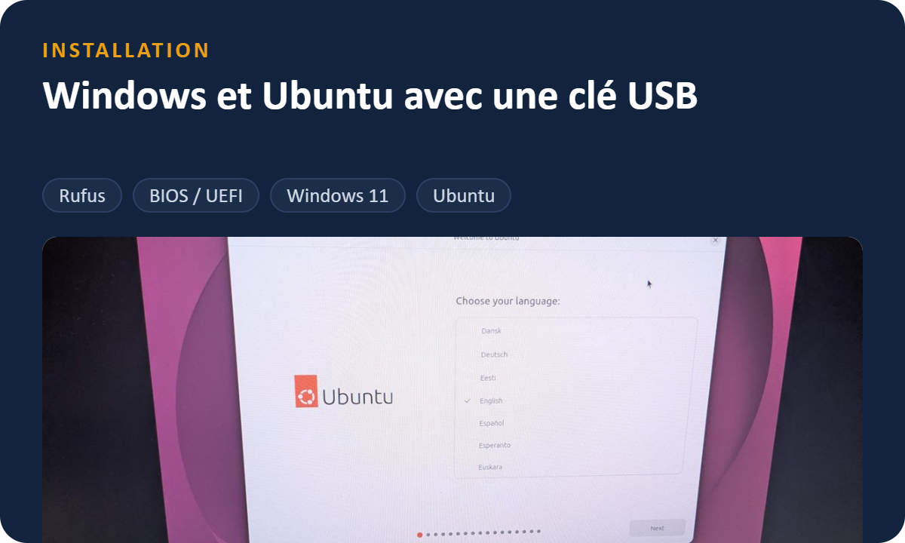

<a href="https://jp-gallego.github.io"></a>

<p align="center">
  <a href="https://jp-gallego.github.io/cv-jean-pierre-gallego.pdf"></a>
  <a href="https://www.linkedin.com/in/jean-pierre-gallego-santillan-6b4701433"></a>
  <br>
  <a href="https://jp-gallego.github.io/jean-pierre-gallego.vcf"></a>
  <a href="mailto:jean-pierre.gallego@git.swiss"></a>
</p>

## Qui je suis

Avant l'informatique, j'ai été monteur électricien pendant plusieurs années. Sur les chantiers, je tirais du câble CAT 6/7 et de la fibre, je raccordais les prises et les racks, puis je testais les liaisons. Pendant mon service militaire, j'étais soldat sanitaire avec une spécialisation transmission.

Depuis septembre 2026, je suis en 1re année d'apprentissage **CFC informaticien** au Geneva Institute of Technology. Aujourd'hui, je configure ce qui passe dans les câbles que je posais avant.

**Je cherche un stage en systèmes, réseaux et infrastructure, entre Lausanne et Genève.**

```
2017 ─ 2020   CFC d'électricien
2021 ─ 2026   Monteur électricien (câblage réseau, fibre, racks)
2025          Service militaire : soldat sanitaire, spécialisation transmission
2026 ─ ...    Apprentissage CFC informaticien au GIT
```

## Mes 5 projets

Pour chaque projet, j'ai écrit un rapport avec les étapes, les captures d'écran et les problèmes que j'ai eus. Cliquez sur une image pour l'ouvrir.

<table>
  <tr>
    <td width="50%"><a href="https://github.com/jp-gallego/Projet-cfc-informaticien/tree/main/Reseau-GNS3-routage-DHCP"></a></td>
    <td width="50%"><a href="https://github.com/jp-gallego/Projet-cfc-informaticien/tree/main/ESXi-vCenter"></a></td>
  </tr>
  <tr>
    <td>Deux LAN reliés par deux routeurs Cisco 7200. Chaque routeur donne les adresses à ses PC en DHCP. J'explique aussi les pannes que j'ai eues et comment je les ai trouvées.</td>
    <td>ESXi 8 installé sur un serveur rack HP ProLiant, une VM Windows Server 2025 avec snapshot, puis vCenter pour gérer l'hôte dans un cluster.</td>
  </tr>
  <tr>
    <td><a href="https://github.com/jp-gallego/Projet-cfc-informaticien/tree/main/Projet-5-Deploiement-image-systeme"></a></td>
    <td><a href="https://github.com/jp-gallego/Projet-cfc-informaticien/tree/main/Projet-2-Poste-multi-utilisateurs"></a></td>
  </tr>
  <tr>
    <td>Un poste Windows 10 de référence, généralisé avec Sysprep, capturé puis redéployé avec Clonezilla. Pour 10 postes, ça fait gagner plusieurs heures.</td>
    <td>Un compte par élève, chacun ne voit que ses dossiers (droits NTFS), avec verrouillage de session et règles de mots de passe. J'ai tout testé compte par compte.</td>
  </tr>
  <tr>
    <td><a href="https://github.com/jp-gallego/Projet-cfc-informaticien/tree/main/Installation-Windows-Ubuntu-cle-USB"></a></td>
    <td valign="top">
      <b>Mes autres projets de formation</b><br><br>
      • <a href="https://github.com/jp-gallego/Projet-cfc-informaticien/tree/main/Installation-Windows-11-VMware">Windows 11 sur VMware Workstation</a><br>
      • <a href="https://github.com/jp-gallego/Projet-cfc-informaticien/tree/main/Projet-1-Mise-en-service-poste">Mise en service d'un poste</a><br>
      • <a href="https://github.com/jp-gallego/Projet-cfc-informaticien/tree/main/Projet-3-Migration-poste">Migration et réinstallation d'un poste</a><br>
      • <a href="https://github.com/jp-gallego/Projet-cfc-informaticien/tree/main/Projet-4-Depannage-poste">Dépannage d'une carte réseau</a><br><br>
      Tout est rangé dans <a href="https://github.com/jp-gallego/Projet-cfc-informaticien">Projet-cfc-informaticien</a>.
    </td>
  </tr>
  <tr>
    <td>Sur un vrai PC : clé bootable avec Rufus, démarrage depuis le BIOS, puis installation de Windows 11 et d'Ubuntu.</td>
    <td></td>
  </tr>
</table>

## Ce que j'utilise

**Systèmes :** `Windows 10 / 11` `Ubuntu` `PowerShell` `comptes et droits NTFS` `Sysprep` `Clonezilla`  
**Virtualisation :** `VMware Workstation` `ESXi 8` `vCenter`  
**Réseau :** `GNS3` `Cisco IOS` `DHCP` `routage statique` `adressage IP`  
**Sur le terrain :** `câblage CAT 6/7` `fibre optique` `prises et racks` `tests de liaison`

Langues : français et espagnol (langues maternelles), anglais (A2).

---

<p align="center">
  Lausanne · <a href="mailto:jean-pierre.gallego@git.swiss">jean-pierre.gallego@git.swiss</a> · <a href="https://jp-gallego.github.io">jp-gallego.github.io</a>
</p>
